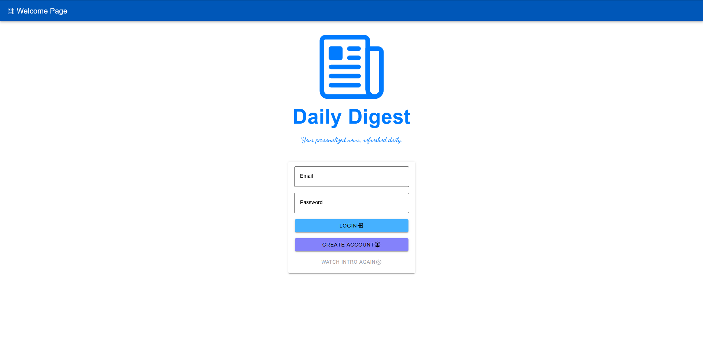
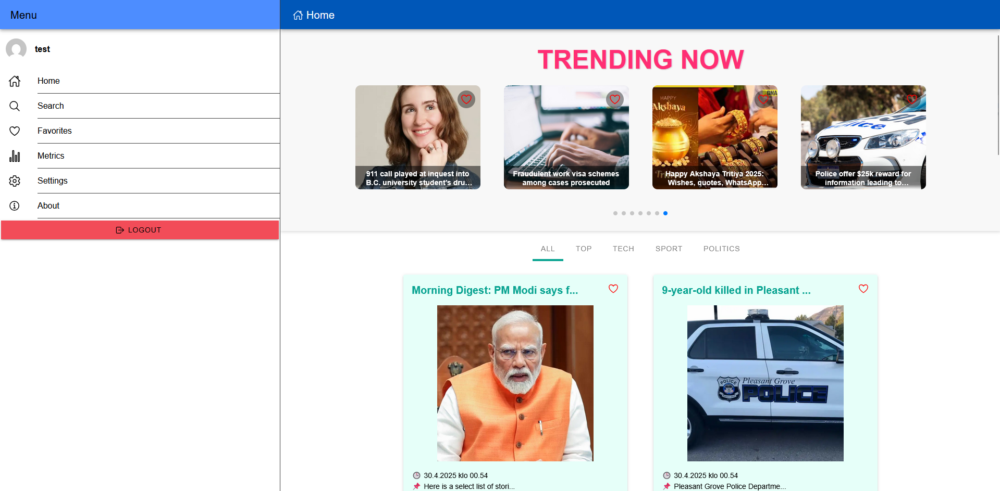
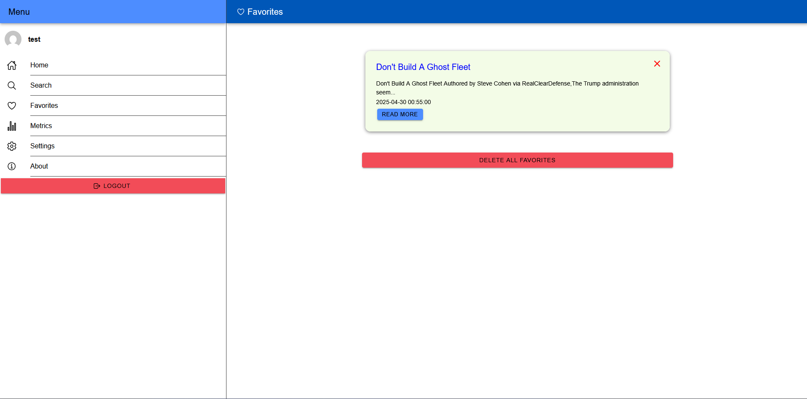
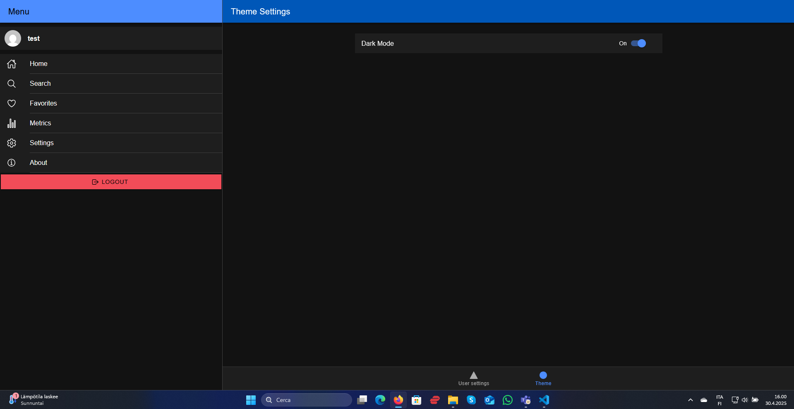
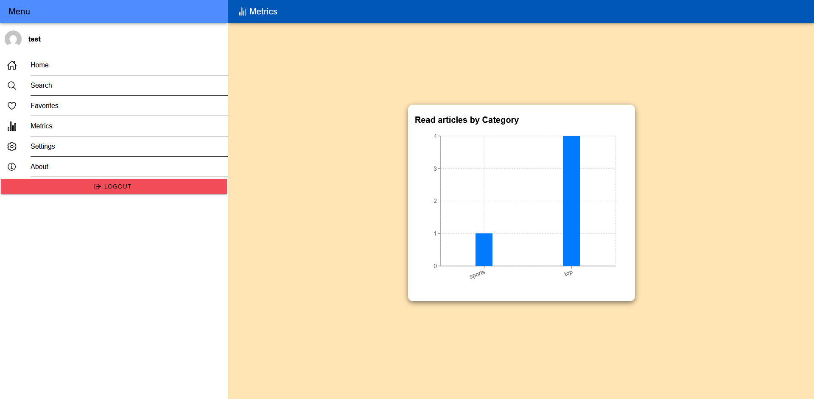
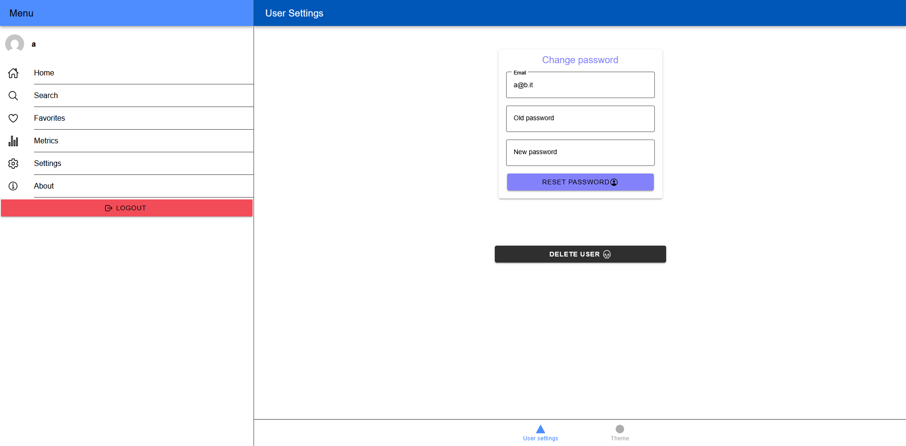

# 📰 Daily Digest App

A mobile-friendly news aggregation app built with **Ionic React**, powered by **NewsData API** and **Firebase** for authentication and storage. The app allows users to:

- Browse trending news
- Save favorite articles
- Enable dark mode
- View personal metrics
- Register/login securely
---
<br>

## Table of Contents
- [Table of Contents](#table-of-contents)
- [👥 User Needs](#-user-needs)
- [🚀 Features](#-features)
- [🧪 Test User Access](#-test-user-access)
- [⏱️ News Fetching Behavior](#️-news-fetching-behavior)
- [📦 Tech Stack](#-tech-stack)
- [🔐 Environment Variables](#-environment-variables)
- [📱 Build \& Run](#-build--run)
  - [Local Development](#local-development)
  - [Android Production Build](#android-production-build)
- [🎨 Style Guide](#-style-guide)
  - [🔵 Color Palette](#-color-palette)
  - [🔤 Typography](#-typography)
  - [🧱 Layout \& Spacing](#-layout--spacing)
  - [🌓 Theme Modes](#-theme-modes)
  - [🧩 Components](#-components)
  - [💡 Alerts \& Toasts](#-alerts--toasts)
  - [📱 Responsiveness](#-responsiveness)
  - [📁 File Organization](#-file-organization)
- [🧭 Routing Structure](#-routing-structure)
  - [🛡️ Route Types](#️-route-types)
  - [🗺️ Main Routes](#️-main-routes)
- [| `/app/not-found` | 404 Page         | Catch-All   |](#-appnot-found--404-page----------catch-all---)
- [🚧 Areas for Improvement](#-areas-for-improvement)
  - [🕒 News Fetching Model](#-news-fetching-model)
  - [🔄 Favorites Sync Enhancements](#-favorites-sync-enhancements)
  - [📂 Article Categorization](#-article-categorization)
  - [🧪 Testing Coverage](#-testing-coverage)
- [📸 Screenshots](#-screenshots)
---

<br>

## 👥 User Needs

The **Daily Digest App** addresses the following user needs:

- 📲 Quick access to relevant news — Users can browse a curated feed of trending articles without needing to visit multiple news sites.
- ❤️ Personal content management — Users can save favorite articles to revisit later.
- 🌙 Accessibility and comfort — Dark mode enhances reading experience in low-light environments.
- 🌍 Multilingual content — Supports English, Finnish, and Italian articles for broader reach.
- 🔒 Secure and personal experience — Each user has a private account with persistent settings like dark mode and favorites.

---

<br>

## 🚀 Features

- 🔒 User authentication (Firebase Auth)
- 🗞️ Live news feed with hourly updates
- ❤️ Save and view favorite articles
- 🌙 Dark mode support
- 📊 User metrics tracking
- 📱 Responsive, mobile-first design
- 🌍 Multilingual articles (EN, FI, IT)
---

<br>

## 🧪 Test User Access

You can explore the app quickly using a test account:

- **Email**: `test@test.test`  
- **Password**: `123456`

> ⚠️ Password changes and account deletion are **disabled** for the test user to ensure demo stability.

All other users can:

- Change their password  
- Permanently delete their account from within the app


<br>

## ⏱️ News Fetching Behavior

- On first login, the app immediately fetches the latest articles for the user.
- Afterward, it fetches fresh articles once per hour, based on the current time in the Helsinki time zone.
- This ensures news content is relevant while avoiding unnecessary API calls and staying within the rate limits of the NewsData API.
---
<br>

## 📦 Tech Stack

- **Frontend**: Ionic React, Swiper, TypeScript
- **Backend/Storage**: Firebase Firestore
- **Authentication**: Firebase Auth
- **News API**: [NewsData.io](https://newsdata.io/)
- **Styling**: Custom CSS, Ionicons
- **Analytics**: In-app metrics view
- **Routing**: React Router
---

<br>

## 🔐 Environment Variables

Rename `.env.example` → `.env` and set the following:

```env
VITE_NEWSDATA_API_KEY_1=your_key
VITE_NEWSDATA_API_KEY_2=your_key
VITE_NEWSDATA_API_KEY_3=your_key
VITE_FIREBASE_API_KEY=your_key
VITE_AUTH_DOMAIN=your_project.firebaseapp.com
VITE_PROJECT_ID=your_project_id
VITE_STORAGE_BUCKET=your_project.appspot.com
VITE_MESSAGING_SENDER_ID=your_sender_id
VITE_APP_ID=your_app_id
```
---

<br>

## 📱 Build & Run
### Local Development
```bash
npm install
npm run dev
```
### Android Production Build
```bash
npm install
npm run dev
```
In Android Studio: build → generate signed bundle → upload to Play Store or test locally.

---

<br>

## 🎨 Style Guide
The design of **Daily Digest** focuses on clarity, readability, and responsiveness. Below are the key guidelines and components used across the app:

### 🔵 Color Palette

| Element            | Light Mode            | Dark Mode              |
|--------------------|-----------------------|------------------------|
| Primary Background | `#ffffff`             | `#121212`              |
| Header Bar         | `#0057B8` (blue)      | `#0057B8`              |
| Text               | `#000000`             | `#ffffff`              |
| Accent Icons       | `red`, `#4CAF50`      | `red`, `#4CAF50`       |

### 🔤 Typography

- **Base Font**: System default (Ionic uses `Roboto`, `Helvetica Neue`, `Arial`)
- **Font Sizes**:
  - Titles: `1.2rem` – `1.5rem`
  - Body: `0.9rem` – `1.1rem`
  - Small text: `0.75rem`
- **Font Weight**: Medium to Bold for titles and section headings

### 🧱 Layout & Spacing

- **Grid system**: Based on Ionic’s `IonGrid`, `IonRow`, and `IonCol`
- **Card Layout**:
  - Used for displaying articles and feed content
  - Border-radius: `10px`
  - Shadow: subtle for light mode; flat for dark mode
- **Swiper Slides**:
  - Responsive horizontal cards
  - Autoplay enabled with pause-on-hover
  - Adaptive layout for 1–4 cards depending on screen width

### 🌓 Theme Modes

Dark mode is user-specific and persisted in Firestore. It affects:

- `IonContent` background
- Card backgrounds and titles
- Text color inversion
- Swiper container class:
  - `swiper-wrapper-fullwidth-dark`
  - `swiper-wrapper-fullwidth-light`

### 🧩 Components

| Component      | Customization Notes                                           |
|----------------|---------------------------------------------------------------|
| `IonSegment`   | Scrollable, styled for category switching                     |
| `IonCard`      | Light/dark themed, holds article image, title, metadata       |
| `IonIcon`      | Used for 'save to favorites' (heart), home, etc.              |
| `IonButton`    | Small size, primary styling, used for "View Full Article"     |
| `IonImg`       | Images auto-cropped via `object-fit: cover`, size `300x300px` |

### 💡 Alerts & Toasts

- Powered by `sonner` toast library
- Position: `top-center`
- Duration: `4000ms`
- Variants: `info`, `success`, `error`
- Example: _"This article is already in your favorites."_ (info)

### 📱 Responsiveness

- Swiper and layout adapt at breakpoints:
  - `320px`: 1 slide
  - `600px`: 2 slides
  - `1100px`: 3 slides
  - `1500px`: 4 slides
- Mobile-first layout with spacing adjusted using `ion-padding` and CSS flexbox

### 📁 File Organization

- `Home.css`, `Favorites.css`, `Login.css`, etc. scoped per page
- Global classes follow naming like `.colored-card-dark`, `.swiper-title`, etc.

---

<br>

## 🧭 Routing Structure

The app uses **React Router** to manage navigation across protected and public pages.

### 🛡️ Route Types

| Route Type       | Description                                                                 |
|------------------|-----------------------------------------------------------------------------|
| `ProtectedRoute` | Guards authenticated routes like `/app/home`, `/app/favorites`, `/app/metrics` |
| `PublicRoute`    | Used for `/login` and `/register`. Redirects to `/app/home` if already logged in |
| `NotFoundRoute`  | Catches all undefined routes and redirects to `/app/not-found`              |

### 🗺️ Main Routes

| Path             | Page             | Access Type |
|------------------|------------------|-------------|
| `/login`         | Login Page       | Public      |
| `/register`      | Register Page    | Public      |
| `/app/home`      | Home Feed        | Protected   |
| `/app/favorites` | Favorites        | Protected   |
| `/app/metrics`   | User Metrics     | Protected   |
| `/app/about`     | About App        | Protected   |
| `/app/not-found` | 404 Page         | Catch-All   |
---

<br>

## 🚧 Areas for Improvement

While the Daily Digest App is functional and user-friendly, there are some known limitations and improvement opportunities:

### 🕒 News Fetching Model

- Currently, the app fetches fresh articles only on user login to avoid exceeding API rate limits.

- Ideally, all users should receive the same hourly news, regardless of login time.

- Implementing a background server fetch or cron job would require a paid NewsData.io subscription or cloud backend.

### 🔄 Favorites Sync Enhancements
- Favorites are stored in Firestore but are not yet synced across multiple devices for the same user.
  
- Could improve with real-time Firestore listeners or cloud functions.

### 📂 Article Categorization

- Categories are based on free-form API data and may result in inconsistent classification.
  
- A manual or AI-based tagging layer could enhance discoverability.
- 
### 🧪 Testing Coverage

- Basic unit and e2e testing are implemented.
  
- Could be expanded with more edge cases and error-handling tests, especially for network failures.

## 📸 Screenshots

| Login | Home | Favorites |
|-------|------|-----------|
|  |  |  |

| Dark Mode | Metrics | User Settings |
|-----------|---------|---------------|   
|  |  |  |

